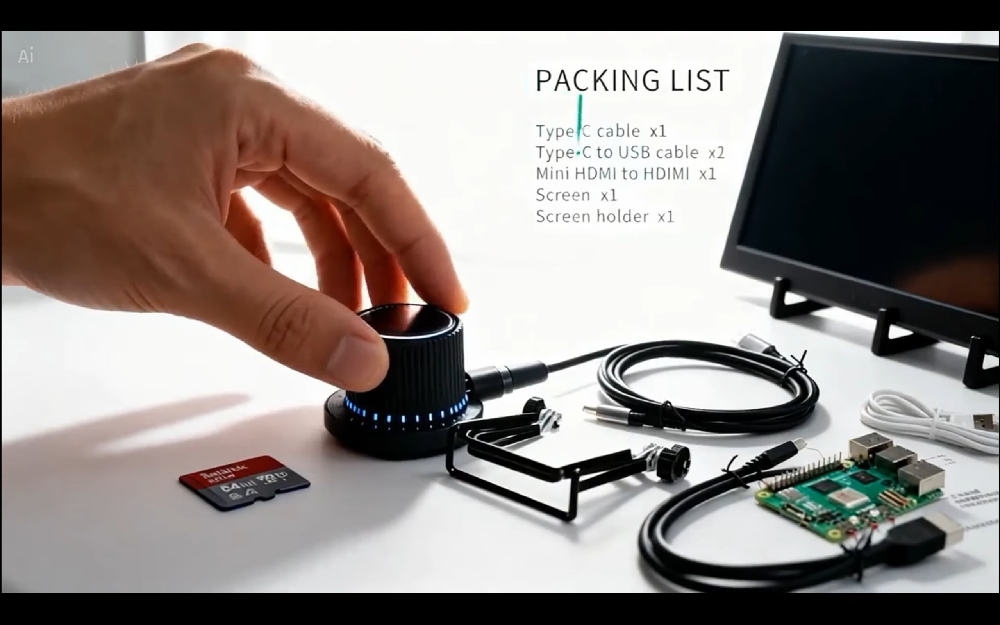
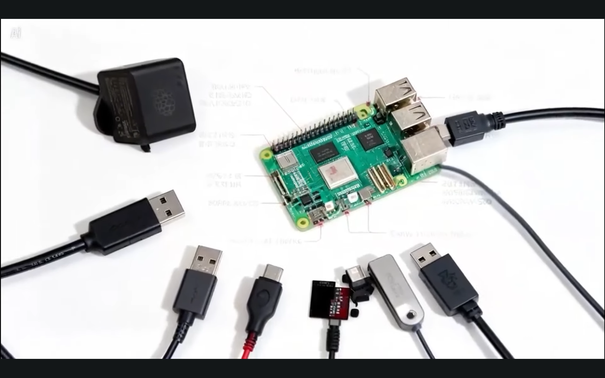
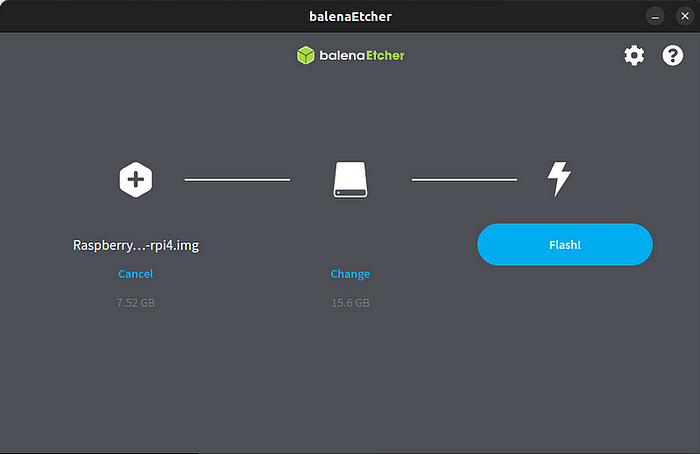

# Android Automotive (AAOS 15) on Raspberry Pi 4

🎥 Watch the setup video: https://youtu.be/8PzioE3GsRo

This repository contains instructions and scripts for building and installing Android Automotive on a Raspberry Pi 4.



## Prerequisites

Before we do this, we need the following environment:

- A 64-bit Linux build machine with more than 32GB RAM and at least 400GB free storage
- Ubuntu 22.04.3 

- A Raspberry Pi 4 (any model)
- Touchscreen display or monitor for the Raspberry Pi
- At least a 16GB SD card for flashing the image
- SD card speed should be at least 12.5 MB/s to avoid performance issues
- Basic knowledge of using the terminal



## Step 1: Set Up Your Build Environment

1. **Install necessary packages:**
   ```bash
   sudo apt update 
   
   sudo apt-get install openjdk-11-jdk git python3 bison flex git  bc build-essential curl g++-multilib gcc-multilib  lib32ncurses5-dev lib32readline-dev liblz4-tool libncurses5 libncurses5-dev meson cmake pkg-config

   sudo apt install python-is-python3

   sudo apt install pip
   
   sudo apt install repo
   
   sudo apt install unzip 
   
   sudo apt-get install -y mtools dosfstools
   ```

## Step 2: Start a Persistent Terminal Session

1. **Start a tmux session so the build can continue even if the terminal disconnects:**
   ```bash
   tmux new -s work
   ```

2. **Reattach to the tmux session to continue monitoring:**
   ```bash
   tmux attach -t work
   ```

3. **Change ownership of the AAOS directory:**
   ```bash
   sudo chown -R $(whoami):$(whoami) /mnt/aaos
   ```

## Step 3: Download and Build the Android Source

1. **Create a directory for the Android source:**
   ```bash
   mkdir ~/android
   cd ~/android
   ```

2. **Initialize and sync the Android repository:**
   ```bash
   repo init -u https://android.googlesource.com/platform/manifest -b android-15.0.0_r32 --depth=1
   
   curl -o .repo/local_manifests/manifest_brcm_rpi.xml -L https://raw.githubusercontent.com/raspberry-vanilla/android_local_manifest/android-15.0/manifest_brcm_rpi.xml --create-dirs
   
   curl -o .repo/local_manifests/remove_projects.xml -L https://raw.githubusercontent.com/raspberry-vanilla/android_local_manifest/android-15.0/remove_projects.xml

   ```

   ```bash
   repo sync -j$(nproc)
   ```  

3. **Set up the build environment:**
   ```bash
   source build/envsetup.sh
   lunch aosp_rpi4_car-userdebug
   ```

4. **Build the Android system images:**
   ```bash
   make bootimage systemimage vendorimage -j$(nproc)
   ```


   
   - **Boot Image:** A specific package that contains the kernel and RAMDisk, which is necessary for the device's boot process.
   - **System Image:** Contains the Android system files, including the framework, libraries, and system apps. It is mounted as the `/system` partition on the device.
   - **Vendor Image:** Includes the hardware-specific binaries and libraries needed for the device to function. These files are part of the `/vendor` partition on the device.

## Step 4: Creating RPi Boot Image

1. **Run the boot image creation script located in the root folder of the source code:**

   ```bash
   source build/envsetup.sh

   lunch aosp_rpi4_car-userdebug

   ./rpi4-mkimg.sh
   ```

2. **When this script is done, a boot image will be created:**
   ```
   Done, created .../out/target/product/rpi4/RaspberryVanillaAOSP14–202531178-rpi4.img!
   ```

## Step 5: Creating Bootable SD Card

1. **Insert the SD card into your Linux machine.**

2. **Use BalenaEtcher to flash the image to the SD card:**
   
   
   
    Download and install [BalenaEtcher](https://www.balena.io/etcher/)
   - Select the built image located at `out/target/product/rpi4/RaspberryVanillaAOSP14–202531178-rpi4.img`
   - Specify the SD card as the target device
   - Click **Flash** to write the image to the SD card


## Final Steps

1. **Insert the SD card into your Raspberry Pi 4 and power it on.**
2. **The Raspberry Pi should boot into Android Automotive.**


> 🎥 I also made a YouTube video guide for this process:
> https://youtu.be/8PzioE3GsRo

## References

- [Downloading the Android source](http://source.android.com/source/downloading.html)
- [Building Android](http://source.android.com/source/building.html)
- [Kernel source for Raspberry Pi](https://github.com/android-rpi/kernel_manifest/tree/arpi14-6.1.62)
- [Building kernels](https://source.android.com/setup/build/building-kernels)
- [Device manifest for Raspberry Pi 4](https://github.com/android-rpi/device_arpi_rpi4)
